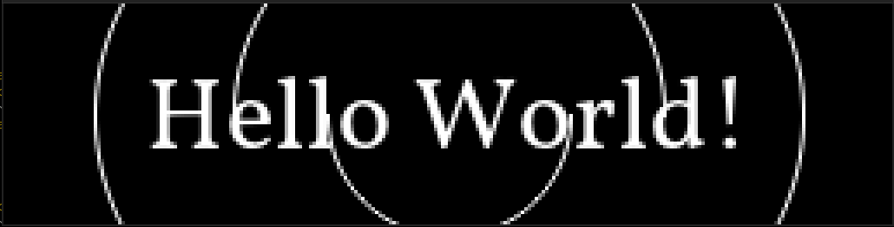

# font_lib
A minimalistic font and graphics library for small microcontrollers.

I know there are many out there already but none of them ticked all the boxes for me. So far we got:

  - [x] Easy to use python tool based on freetype to convert (almost) any font format to the internally used bitmap-font
  - [x] Anti-aliasing, variable width and UTF-8 support for emojis / icons
  - [x] Support for 1, 4 and 8 bit / pixel mode
  - [x] SDL2 simulator
  - [x] The embedded library is usable with small microcontrollers with < 32 kB program memory
  - [x] The font is stored either in a header file (together with the program code) or in a binary `.fnt` file, which can be __streamed__ from SD-card, which allows to draw huge fonts with little extra ram besides the framebuffer
  - [x] The framebuffer is organized with the same memory layout as the target display controller chip, such that the content can be sent out directly over DMA
  - [x] SSD1306 (1 bit) and SSD1322 (4 bit) are supported so far
  - [x] Bits per pixel and framebuffer size are defined at compile time
  - [x] Low level graphics: line, ellipse. Both can be anti-aliased
  - [ ] Rectangle, filled rectangle, rectangle with rounded corners, filled ellipse
  - [ ] Higher level graphics: updateable label, message box, button, progress bar
  - [ ] Re-usable screen manager (which screen is shown) and event system (short / long button push events, encoder events)
  - [ ] Re-usable menu system


# Simulator
Try out the included demo program on a linux PC.

Make sure `libsdl2` and [`platform.io`](https://docs.platformio.org/en/latest/core/installation/methods/installer-script.html#installation-installer-script) are installed.

Then compile and run the simulator with

```bash
pio run
.pio/build/native/program
```



You can type and the text should change.

Try to change `FB_BPP`, `FB_WIDTH` and `FB_HEIGHT` in `platform.ini`. The demo program should adapt.

Try to convert a font-file with `util/font_converter.py` and replace the included demo font `src/vollkorn.h`.
